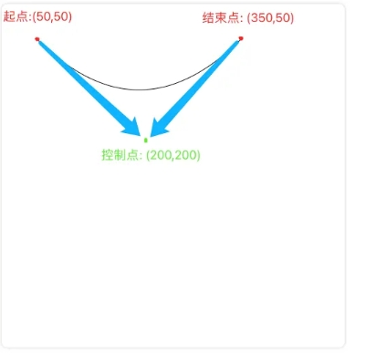
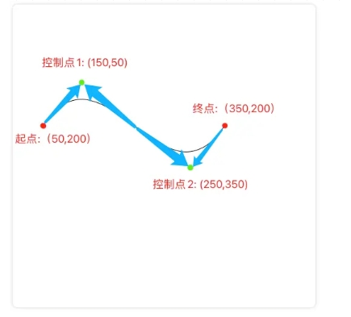
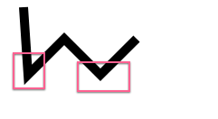
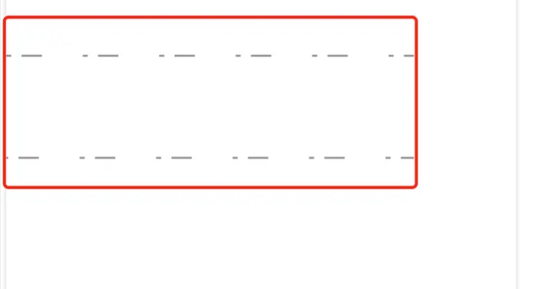
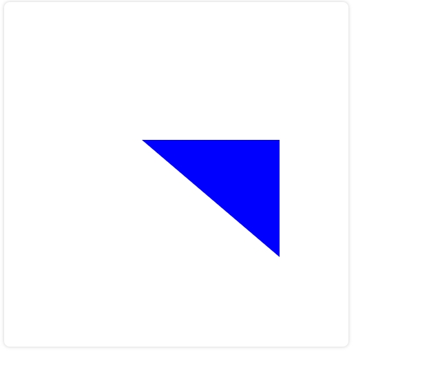

# Canvas 2d基础入门

Canvas 最早是由 Apple 引入 WebKit，用于Mac OS X 的 Dashboard，随后被各个浏览器实现。如今除一些过时的浏览器不支持Canvas元素外，所有的新版本主流浏览器都支持它。

## API

#### 1、getContext(contextType, contextAttributes)

获取渲染上下文和绘画功能

**接收参数：**

- **contextType**：

​	为绘制上下文的类型，类型参数有：

> 1. 2d：建立一个二维渲染上下文。这种情况可以用 CanvasRenderingContext2D()来替换getContext('2d')。
> 2. webgl（或 experimental-webgl）： 创建一个 WebGLRenderingContext 三维渲染上下文对象。只在实现WebGL 版本1(OpenGL ES 2.0)的浏览器上可用。
> 3. webgl2（或 experimental-webgl2）：创建一个 WebGL2RenderingContext 三维渲染上下文对象。只在实现 WebGL 版本2 (OpenGL ES 3.0)的浏览器上可用。
> 4. bitmaprenderer：创建一个只提供将canvas内容替换为指定ImageBitmap功能的ImageBitmapRenderingContext。

​	

- **contextAttributes：**

​	为绘制上下文的属性，这些属性相对比较多，可以设置单个也可以同时设置多个，下面列一下，方便大家了解：

> 1. 2D类型的参数有： 
>
>    (1)、`alpha` 它的值为Boolean类型，如果设置为false, 浏览器将认Canvas背景总是不透明的，这样可以做到一些性能提效。
>
>    (2)、`willReadFrequently`，值也为Boolean类型，用于表明是否要重复操作，频繁调用`getImageData()`方法时能节省内存，但是仅Gecko内核浏览器支持。
>
>    (3)、`storage`用于表明使用哪种方式存储，默认值 persisten，表示持久化存储。
>
> 2. 3D类型的参数有： 
>
>    (1)、`alpha` 值为Boolean类型，指示画布是否包含alpha缓冲区。 
>
>    (2)、`antialias` 值为Boolean类型，指示是否开启抗锯齿。 
>
>    (3)、`depth` 值为Boolean类型，表示绘图缓冲区的深度缓冲区至少为16位。 
>
>    (4)、`failIfMajorPerformanceCaveat`值为Boolean类型，指示如果系统性能较低，是否创建上下文。 
>
>    (5)、`powerPreference`：对用户代理的提示，指示GPU的哪种配置适合WebGL上下文。可能的值是： `default`: 自动选择模式，自动决定哪种GPU配置最合适，为默认值。 `high-performance`: 高性能模式，优先考虑渲染性能而不是功耗。 `low-power`: 节能模式，优先考虑节能而不是渲染性能。 
>
>    (6)、`premultipliedAlpha` 值为Boolean类型，表示页面合成器将假定绘图缓冲区包含具有预乘alpha的颜色。 
>
>    (7)、`preserveDrawingBuffer` 值为Boolean类型，如果值为true，则不会清除缓冲区并保留其值，直到被清除或被使用者覆盖。 
>
>    (8)、`stencil` 值为Boolean类型，表示绘图缓冲区具有至少8位的模板缓冲区。


## 一、绘制形状

### 1、线

#### (1) moveTo(x,y)

设置初始位置，参数为初始位置x和y的坐标点

**参数说明：**

- ``x、y``：位置坐标

#### (2) lineTo(x,y)

绘制一条从初始位置到指定位置的直线，参数为指定位置x和y的坐标点

**参数说明：**

- ``x、y``：位置坐标

#### (3) stroke()

通过线条来绘制图形轮廓

### 2、矩形

#### (1) strokeRect(x,y,width,height)

绘制一个矩形的边框

**参数说明：**

- ``x、y``：矩形的起点坐标
- ``width``：矩形的宽度
- ``height``：矩形的高度

#### (2) fillRect(x,y,width,height)

绘制一个填充的矩形

**参数说明：**

- ``x、y``：矩形的起点坐标
- ``width``：矩形的宽度
- ``height``：矩形的高度

#### (3) clearRect(x,y,width,height)

清除指定矩形区域，让清除部分完全透明

**参数说明：**

- ``x、y``：矩形的起点坐标
- ``width``：矩形的宽度
- ``height``：矩形的高度


### 3、圆

#### (1) arc(x,y,radius,startAngle,endAngle,anticlockwise)

绘制圆弧或圆

**参数说明：**

- ``x、y``：x和y为圆心的坐标
- ``radius``：为半径
- ``startAngle``：为圆弧或圆的开始位置
- ``endAngle``：为圆弧或圆的结束位置
- ``anticlockwise``：是绘制的方向(不写默认为false，从顺时针方向)


### 4、开启和闭合路径

每次新建路径的时候都需要开启和闭合路径，这样不同路径之间才不会相互干扰。

#### (1) beginPath()

新建一条路径，生成之后，图形绘制命令被指向到路径上

#### (2) closePath()

闭合路径之后图形绘制命令又重新指向到上下文中


### 5、填充

#### (1) fill()

stroke方法是通过线条来绘制图形轮廓，而fill方法则是通过填充路径的内容区域生成实心的图形

#### (2) stroke()

通过线条来绘制图形轮廓


### 6、椭圆

#### (1) ellipse(x,y,radiusX,radiusY,rotation,startAngle,endAngle,anticlockwise)

添加椭圆路径

**参数说明：**

- ``x、y``：椭圆的圆心位置
- ``radiusX、radiusY``：x轴和y轴的半径
- ``rotation``：椭圆的旋转角度、已弧度表示
- ``startAngle``：开始绘制点
- ``endAngle``：结束绘制点
- ``anticlockwise``：绘制的方向（默认顺时针），可选参数


### 7、贝塞尔曲线

#### (1) quadraticCurveTo(cp1x,cp1y,x,y)

二次贝塞尔曲线

**参数说明：**

- ``cp1x``：控制点的x轴
- ``cp1y``：控制点的y轴位置
- ``x``：结束点的x轴位置（与lineTo中的x作用一样）
- ``y``：结束点的y轴位置（与lineTo中的y作用一样）

**代码演示：**

```javascript
// 获取 canvas 元素
var canvas = document.getElementById('canvas');
// 通过判断getContext方法是否存在来判断浏览器的支持性
if(canvas.getContext) {
    // 获取绘图上下文
    var ctx = canvas.getContext('2d');
    // 绘制一段二次贝塞尔曲线
    ctx.moveTo(50, 50);
    ctx.quadraticCurveTo(200, 200, 350, 50);
    // 绘制
    ctx.stroke();
}
```

**效果图如下：**




#### (2) bezierCurveTo(cp1x,cp1y,cp2x,cp2y,x,y)

三次贝塞尔曲线和二次贝塞尔曲线不同的是多了一个控制点

**参数说明：**

- ``cp1x``：控制点1的x轴
- ``cp1y``：控制点1的y轴位置
- ``cp2x``：控制点2的x轴
- ``cp2y``：控制点2的y轴位置
- ``x``：结束点的x轴位置（与lineTo中的x作用一样）
- ``y``：结束点的y轴位置（与lineTo中的y作用一样）

**代码演示：**

```javascript
      // 获取 canvas 元素
const canvas = document.getElementById("canvas");
// 通过判断 getContext 方法是否存在赖判断浏览器的支持性
if (canvas.getContext) {
    // 获取绘图上下文
    const ctx = canvas.getContext("2d");
    // 绘制一段三次贝塞尔曲线
    ctx.beginPath(); // 开启路径
    ctx.moveTo(50, 200);
    ctx.bezierCurveTo(150, 50, 250, 350, 350, 200);
    // 绘制
    ctx.stroke();
}
```

**效果图如下：**



## 二、绘制样式

### 1、线条的样式

#### (1) lineWidth

lineWidth 设置当前绘线的粗细，属性必须为正数。默认值为1.0


#### (2) lineCap

lineCap 设置线段端点显示的样子。默认是 butt。

**可选值：**

- butt （末端结束，没有扩展超过其末端）
- round （末端会以半圆形结束，半圆的直径等于线宽，端点处加上了半径为一半线宽的半圆）
- square（末端会以矩形结束，矩形的长度等于线宽，端点处加上了等宽且高度为一半线宽的方块）


#### (3) lineJoin

lineJoin 该属性可以设置两线段连接处所显示的样子。默认是 miter。

**可选值：**

- miter（交点将显示为尖角）
- round （交点将显示为圆角）
- bevel（交点将显示为斜角）


#### (4) miterLimit

miterLimit 限制当两条线相交时交接处最大长度；所谓交接处长度（斜接长度）是指线条交接处内角顶点到外角顶点的长度。

线段之间夹角比较大时，交点不会太远，但随着夹角变小，交点距离会呈指数级增大。




第一个接合处的夹角比较小，接合处会比较尖，交点距离比较大 第二个接合处的夹角比较大，接合处就比较平缓。


`miterLimit` 属性就是用来设定外延交点与连接点的最大距离，默认值为 ``10``，如果交点距离大于此值，**``lineJoin``**  会变成了  **``bevel``**


#### (5) setLineDash/getLineDash

setLineDash 可以设置当前虚线样式。

setLineDash(arr) 中的 arr 长度为 ``奇数`` 或 ``偶数`` 时的效果不太一样

getLineDash 则是返回当前虚线设置的样式，长度为非负偶数的数组。

**代码示例：**

```javascript
 // 获取绘图上下文
      var ctx = canvas.getContext('2d');
      // 绘制一条虚线
      ctx.setLineDash([5, 10, 20]);
      console.log(ctx.getLineDash()); // [5, 10, 20, 5, 10, 20]
      ctx.beginPath();
      ctx.moveTo(0,100);
      ctx.lineTo(400, 100);
      ctx.stroke();
      // 再绘制一条虚线
      ctx.setLineDash([5, 10, 20, 40]);
      console.log(ctx.getLineDash()); // [5, 10, 20, 40]
      ctx.beginPath();
      ctx.moveTo(0,200);
      ctx.lineTo(400, 200);
      ctx.stroke();

```

**效果图如下：**


**对比一下传参为奇数数组和偶数数组的区别：**

设置虚线的时候，如果传参为奇数，例如：ctx.setLineDash([5, 10, 20])，那么 setLineDash 会复制一份数组补全为偶数，相当于我们设置的是：ctx.setLineDash([5, 10, 20, 5, 10, 20])。所以这也就是为什么上图中我们设置的是 [5, 10, 20]，结果打印出来是 [5, 10, 20, 5, 10, 20]


#### (6) lineDashOffect

lineDashOffset 设置虚线样式的起始偏移量。

**代码示例：**

```javascript
// 再绘制一条虚线
ctx.setLineDash([5, 10, 20, 40]);
console.log("获取虚线样式", ctx.getLineDash()); // [5, 10, 20, 40]
ctx.beginPath();
ctx.moveTo(0, 200);
ctx.lineTo(400, 200);
ctx.stroke();
ctx.closePath();

// 添加 lineDashOffset 设置虚线样式的起始偏移量
ctx.setLineDash([5, 10, 20, 40]);
ctx.lineDashOffset = 3;
ctx.beginPath();
ctx.moveTo(0, 300);
ctx.lineTo(400, 300);
ctx.stroke();
ctx.closePath();
```

**效果图如下：**



可以明显看出虚线的总长度没有变化，只是起始点向左位移了3像素。


#### (7) strokeStyle

设置描边样式

**代码示例：**

```javascript
const ctx = canvas.getContext('2d'); // 获取绘制上下文
ctx.strokeStyle = "#f00" // 描边样式设置为红色
ctx.lineWidth = 5

// 绘制一个三角形
ctx.moveTo(50, 100) 
ctx.lineTo(50, 400)
ctx.lineTo(400, 400)
ctx.lineTo(50, 100) 
ctx.stroke();

```

**效果图如下：**


#### (8) fillStyle

设置填充的样式

**代码示例：**

```javascript
const ctx = canvas.getContext('2d'); // 获取绘制上下文
ctx.fillStyle = "#00f" // 填充样式设置为蓝色
ctx.lineWidth = 5

// 如果是填充一个三角形，则只需两条直线就行，它会默认闭合。
ctx.beginPath()
ctx.moveTo(200, 200) 
ctx.lineTo(400, 200)
ctx.lineTo(400, 370)
ctx.fill();


```

**效果图如下：**




### 2、透明度

(1)globalAlpha

设置透明度值

**代码示例：**

```javascript
const ctx = canvas.getContext('2d'); // 获取绘制上下文
// 绘制一个圆
ctx.beginPath()
ctx.fillStyle = "rgba(255, 255, 0, 1)";
// 设置透明度值
ctx.globalAlpha = 0.5;
ctx.arc(200, 200, 100, 0, Math.PI*2, true);
ctx.fill();


```

**效果图如下：**


### 3、渐变

渐变分为 **两种** ，分别是 ``线性渐变`` 和 ``径向渐变`` ，在绘图中我们可以用线性或者径向来填充或描边。

#### (1) createLinearGradient(x1,y1,x2,y2)

线性渐变

**参数说明：**

- x1：起点的x轴坐标
- y1：起点的y轴坐标
- x2：终点的x轴坐标
- y2：终点的y轴坐标

```javascript
// ****** 配合使用 api ******
/* 1.gradient.addColorStop(offset,color) */
// 在渐变的设置中还需要本方法来添加渐变的颜色
// 参数说明：
// 1. color：颜色
// 2. offset：颜色的偏移值，只为 0 到 1 之间的值
// 案例代码：

// 获取绘制上下文
const ctx = canvas.getContext("2d");
// 创建渐变 1
const gradient1 = ctx.createLinearGradient(10, 10, 400, 10);
gradient1.addColorStop(0, "#00ff00");
gradient1.addColorStop(1, "#ff0000");

// 创建渐变 2
const gradient2 = ctx.createLinearGradient(10, 10, 400, 10);
// 从 0.5 的位置才开始渐变
gradient2.addColorStop(0.5, "#00ff00");
gradient2.addColorStop(1, "#ff0000");

ctx.beginPath();
ctx.fillStyle = gradient1;
ctx.fillRect(10, 10, 400, 100);
ctx.closePath();

ctx.beginPath();
ctx.fillStyle = gradient2;
ctx.fillRect(10, 150, 400, 100);
ctx.closePath();

```

​	**效果图如下：**


#### (2) createRadialGradient(x0,y0,r0,x1,y1,r1)

径向渐变

**参数说明**：

- x0、y0：开始圆的坐标x和y轴坐标
- r0：开始圆的半径
- x1、y1：结束圆的坐标x和y轴坐标
- r1：结束圆的半径

**代码示例：**

```javascript
// 用法和 linearGradient类似都需要通过addColorStop添加颜色和偏移量
// 获取绘制上下文
const ctx = canvas.getContext("2d");

// 创建径向渐变 1
// 结束坐标为点,从 外到里发生渐变
const radialGradient1 = ctx.createRadialGradient(
    100,
    100,
    100,
    100,
    100,
    0
);
radialGradient1.addColorStop(0, "#ff770f");
radialGradient1.addColorStop(1, "#ffffff");

// 创建径向渐变 2
// 结束坐标为半径 30 的圆
const radialGradient2 = ctx.createRadialGradient(
    320,
    100,
    100,
    320,
    100,
    30
);
radialGradient2.addColorStop(0, "#ff770f");
radialGradient2.addColorStop(1, "#ffffff");

// 创建径向渐变 3
// 从 0.5 的位置才开始渲染
const radialGradient3 = ctx.createRadialGradient(
    100,
    320,
    100,
    100,
    320,
    0
);
radialGradient3.addColorStop(0.5, "#ff770f");
radialGradient3.addColorStop(1, "#ffffff");

// 创建径向渐变 4
// 开始坐标 和 结束坐标 不一样
const radialGradient4 = ctx.createRadialGradient(
    320,
    320,
    100,
    250,
    250,
    0
);
radialGradient4.addColorStop(0, "#ff770f");
radialGradient4.addColorStop(1, "#ffffff");

// 矩形 1
ctx.beginPath();
ctx.fillStyle = radialGradient1;
ctx.fillRect(10, 10, 200, 200);
ctx.closePath();

// 矩形 2
ctx.beginPath();
ctx.fillStyle = radialGradient2;
ctx.fillRect(220, 10, 200, 200);
ctx.closePath();

// 矩形 3
ctx.beginPath();
ctx.fillStyle = radialGradient3;
ctx.fillRect(10, 220, 200, 200);
ctx.closePath();

// 矩形 4
ctx.beginPath();
ctx.fillStyle = radialGradient4;
ctx.fillRect(220, 220, 200, 200);
ctx.closePath();
```

**效果图如下：**


### 4、图案样式

#### (1) createPattern(image,type)

Canvas 中想绘制的图案效果，个人理解为对标css中的background-image。

**参数说明：**

- image：可以是一个 ``Image`` 对象，也可以是 ``canvas``对象
- type：图案绘制的类型，可用的类型分别有：``repeat``、``repeat-x``、``repeat-y``、``no-repeat``

**代码案例：**

```javascript
// 创建一个 image 对象
const img = new Image();
img.src = "../../static/test/createPattern.png";
img.onload = () => {
    // 图片加载完后回调
    // 创建图案 1 no-repeat 不平铺
    //   const pattern1 = ctx.createPattern(img, "no-repeat");
    //   ctx.fillStyle = pattern1;
    //   ctx.fillRect(0, 0, 500, 500);

    // 创建图案 2 repeat 平铺
    //   const pattern2 = ctx.createPattern(img, "repeat");
    //   ctx.fillStyle = pattern2;
    //   ctx.fillRect(0, 0, 500, 500);

    // 创建图案 3 x 轴方向平铺
    //   const pattern3 = ctx.createPattern(img, "repeat-x");
    //   ctx.fillStyle = pattern3;
    //   ctx.fillRect(0, 0, 500, 500);

    // 创建图案 4 y 轴方向平铺
    const pattern4 = ctx.createPattern(img, "repeat-y");
    ctx.fillStyle = pattern4;
    ctx.fillRect(0, 0, 500, 500);
```


## 三、绘制文本

canvas 中依旧提供了两种方法来渲染文本，一种是描边一种是填充。

### 1、文字

#### (1) strokeText(text,x,y,maxWidth)

描边绘制文本

**参数说明：**

- text：绘制的文案
- x、y：文本的起始位置
- maxWidth：可选参数、最大宽度。需要注意的是当文案大于最大宽度时不是裁剪或者换行，而是缩小字体

**代码案例：**

```javascript
// 获取绘图上下文
const ctx = canvas.getContext("2d");
ctx.font = "50px serif"; // 设置文案大小和字体
ctx.strokeText("Canvas 详解", 50, 50);
```

**效果图如下：**


#### (2) fillText(text,x,y,maxWidth)

填充绘制文本

**参数说明：**

- text：绘制的文案
- x、y：文本的起始位置
- maxWidth：可选参数，最大宽度。需要注意的是当文案大于最大宽度时不是裁剪或者换行，而是缩小字体。

**代码案例：**

```javascript
// 获取绘图上下文
const ctx = canvas.getContext("2d");
ctx.font = "50px serif"; // 设置文案大小和字体
ctx.fillText("Canvas 详解", 50, 50);
```

**效果图如下：**


### 2、文本样式

文本也是可以添加样式的，下面看一下可以设置哪些样式

#### (1) font

用于绘制文本的样式。

默认的字体样式是 10px sans-serif

​						      文案大小 字体


#### (2) textAlign

文本对齐的方式。**默认值：** ``start``

**可选值：**

- ``left``
- ``right``
- ``center``
- ``start``
- ``end``


#### (3) direction

文字的方向。**默认值：**``inherit``

**可选值：**

- ``ltr`` (文字方向从左到右)
- ``rtl`` (文字方向从右到左)
- ``inherit`` (根据情况继承Canvas元素或者Document)

**注意：**

direction 属性会对 textAlign 属性产生影响。

1. 如果 direction 属性设置为 ``ltr``,则 textAlign 属性的 ``left`` 和 ``start`` 的效果相同，``right`` 和 ``end`` 的效果相同
2. 如果 direction 属性设置为 ``rtl`` 则 textAlign 属性的 ``left`` 和 ``end`` 的效果相同，``right`` 和 ``start`` 的效果相同
2. 当设置为 ``rtl`` 时，**特殊符号结尾**（如``!``、``。``等）会显示在文本的最左边。

**代码案例：**

```javascript
// 获取绘图上下文
const ctx = canvas.getContext("2d");
ctx.font = "30px serif"; // 设置文案大小和字体

// 文字 1
ctx.direction = "ltr"; // 文本方向从左向右
ctx.textAlign = "left"; // 左对齐
ctx.strokeText("Hi Canvas !", 170, 100);

// 文字 2
ctx.direction = "ltr"; // 文本方向从左到右
ctx.textAlign = "center"; // 居中对齐
ctx.strokeText("Hi Canvas !", 170, 200);

// 文本 3
ctx.direction = "ltr"; // 文本方向从左到右
ctx.textAlign = "right"; // 右对齐
ctx.strokeText("Hi Canvas !", 170, 300);

// 文本 4
ctx.direction = "rtl"; // 文本方向从右到左
ctx.textAlign = "left"; // 左对齐
ctx.strokeText("Hi Canvas !", 170, 400);

// 文本 5
ctx.direction = "rtl"; // 文本方向从右到左
ctx.textAlign = "center"; // 居中对齐
ctx.strokeText("Hi Canvas !", 170, 500);

// 文本 6
ctx.direction = "rtl"; // 文本方向从右到左
ctx.textAlign = "right"; // 居中对齐
ctx.strokeText("Hi Canvas !", 170, 600);
```

**效果图如下：**


#### (4) textBaseline

基线的对齐选项，决定文字垂直方向的对齐方式。**默认值：** ``alphabetic``

**可选值：**

- ``top``
- ``hanging``
- ``middle``
- ``alphabetic``
- ``ideographic``
- ``bottom``

**代码示例：**

```` javascript
// 获取绘图上下文
const ctx = canvas.getContext("2d");
ctx.font = "25px serif"; // 设置文案大小和字体
ctx.strokeStyle = "red";
const baselines = [
    "top",
    "hanging",
    "middle",
    "alphabetic",
    "ideographic",
    "bottom",
];
baselines.forEach((baseline, index) => {
    ctx.textBaseline = baseline;
    let y = 60 + index * 60;
    ctx.beginPath();
    ctx.moveTo(10, y + 0.5);
    ctx.lineTo(500, y + 0.5);
    ctx.stroke();
    ctx.fillText(
        `Hi Canvas，Welcome to my world！（${baseline}）`,
        10,
        y
    );
});
````


#### (5) measureText

测量文本，返回一个 TextMetrics 对象

**代码案例：**

```` javascript
// 获取绘图上下文
const ctx = canvas.getContext("2d");
ctx.font = "30px serif"; // 设置文案大小和字体

// 测试文案 1
ctx.beginPath();
ctx.strokeText("Hi Canvas !", 150, 100);
const text = ctx.measureText("Hi Canvas !");
console.log("🚀 ~ 文案宽度：", text.width);

// 测试文案 2
ctx.beginPath();
// 设置了文案最大宽度
ctx.strokeText("Hi Canvas !", 150, 200, 100);
const text1 = ctx.measureText("Hi Canvas !");
console.log("🚀 ~ 文案宽度：", text1.width);
````

**效果图如下：**


**总结：**

返回的 TextMetrics对象不受最大宽度等外界因素所影响。

**TextMetrics属性解析：**

**所有属性都是使用 CSS 像素计算的，并且都是只读**

- TextMetrics.width：基于当前上下文字体，计算内联字符串的宽度。

- TextMetrics.actualBoundingBoxLeft：从 textAlign 属性确定的对齐点到文本矩形边界左侧的距离，使用 CSS 像素计算；正值表示文本矩形边界左侧在该对齐点的左侧。

- TextMetrics.actualBoundingBoxRight：从 textAlign 属性确定的对齐点到文本矩形边界右侧的距离。

- TextMetrics.fontBoundingBoxAscent：从 textBaseline 属性标明的水平线到渲染文本的所有字体的矩形最高边界顶部的距离。

- TextMetrics.fontBoundingBoxDescent：从 textBaseline 属性标明的水平线到渲染文本的所有字体的矩形边界最底部的距离。

- TextMetrics.actualBoundingBoxAscent：从 textBaseline 属性标明的水平线到渲染文本的矩形边界顶部的距离。

- Textetrics.actualBoundingBoxDescent：从 textBaseline 属性标明的水平线到渲染文本的矩形边界底部的距离。

- TextMetrics.emHeightAscent：从 textBaseline 属性标明的水平线到线框中 em 方块顶部的距离。

- TextMetrics.emHeightDescent：从 textBaseline 属性标明的水平线到线框中 em 方块底部的距离。

- TextMetrics.hangingBaseline：从 textBaseline 属性标明的水平线到线框的 hanging 基线的距离。

- TextMetrics.alphabeticBaseline：从 textBaseline 属性标明的水平线到线框的 alphabetic 基线的距离。

- TextMetrics.ideographicBaseline：从 textBaseline 属性标明的水平线到线框的 ideographic 基线的距离。


### 3、阴影

#### (1) shadowOffsetX、shadowOffsetY

``shadowOffsetX`` 和 ``shadowOffsetY`` 用来设定阴影在 X 和 Y 轴的延伸距离，它们是不受变换矩阵所影响的。**负值** 表示阴影会往上或左延伸，**正值** 表示会往下或右延伸。

**默认值：**都为0


#### (2) shadowBlur

shadowBlur 用于设定阴影的模糊程度其数值并不跟像素数量挂钩，也不受变换矩阵的影响。

**默认值：** 0


#### (3) shadowColor

shadowColor 是标准的 css 颜色值，用于设定阴影颜色效果，**默认为 全透明的黑色**

**代码案例：**

```` javascript
// 获取绘图上下文
const ctx = canvas.getContext("2d");

ctx.font = "50px serif"; // 设置文案大小和字体

// 模糊 1
ctx.shadowColor = "#cccccc"; // 设置阴影颜色
ctx.fillStyle = "#ee7934"; // 设置填充颜色
ctx.shadowOffsetX = 10; // X 轴上的阴影
ctx.shadowOffsetY = 10; // Y 轴上的阴影
ctx.shadowBlur = 5; // 阴影的模糊程度
ctx.fillText("Hi Canvas !", 100, 50);
ctx.fillRect(100, 100, 200, 100);

// 模糊 2
ctx.shadowOffsetX = -10;
ctx.shadowOffsetY = -10;
ctx.fillText("Hi Canvas !", 100, 300);
ctx.fillRect(100, 350, 200, 100);
````

**效果图如下：**


## 四、绘制图片

绘制图片和上面的图案样式绘制基本大同小异，不同的是所用方式不一样，绘制图片是使用 drawImage 方法将它渲染到 canvas 里。


### 1、drawImage

drawImage 方法与前文提及的 ``createPattern`` 方法功能类似，都是把图片绘制到 Canvas 中。但 drawImage 功能性相对来说更加的强大，drawImage 方法会根据不同入参实现不同的功能：

1. 绘制图像
2. 缩放图像
3. 裁剪图像

**语法：**

drawImage(Image, sx, sy, sWidth, sHeight, dx, dy, dWidth, dHeight)

**参数：**

- image：绘制的元素 (图像)
- sx、sy：裁剪框左上角的坐标
- sWidth、sHeight：裁剪框的宽度和高度
- dx、dy：绘制元素 (图像) 时左上角的坐标
- dWidth、dHeight：绘制元素 (图像) 的宽度和高度。如果不设置，则在绘制时 image 宽度和高度不会缩放


#### (1) 绘制图像

单纯的图片绘制只需要 ``image``、``dx``、``dy`` 三个参数。

**代码案例：**

```` javascript
const canvas = document.getElementById("canvas"); // 获取Canvas
const ctx = canvas.getContext("2d");

const img = new Image();
img.src = "../static/test/drawImage.webp";
img.onload = () => {
    // drawImage(image, dx, dy)
    // image: 绘制的元素（图像）
    // dx: 绘制元素时左上角的 x 轴坐标
    // dy: 绘制元素时左上角的 y 轴坐标
    ctx.drawImage(img, 0, 0);
}
````

**效果图如下：**


图片已经绘制到了 Canvas 中，但是可以看到在目前呈现出来的效果中，图片并没有完整的绘制出来。所以如果为了能让图片能够完整的呈现出来，那我们就需要将图片进行一个缩放


#### (2) 缩放图像

想要缩放图片就需要在绘制的前提下再设置图片的宽高，也就还需要 ``dWidth`` 和 ``dHeight`` 这两个参数

**代码案例：**

```` javascript
// 获取 canvas 元素
const canvas = document.getElementById("canvas");
// 获取绘制上下文
const ctx = canvas.getContext("2d");

const img = new Image();
img.src = "../static/test/drawImage.webp";
img.onload = () => {
    ctx.drawImage(img, 0, 0, 550, 500);
};
````

**效果图如下：**


经过缩放之后图片不仅绘制再 Canvas 中，并且也能够将图像完整的显示在Canvas中了，那么这时候如果想对图片进行一个裁剪，那么应该如何进行裁剪呢？


#### (3) 裁剪图像

想裁剪图片就需要在缩放的前提下在设置图片要显示的位置和裁剪的大小，也就还需要 ``sx`` 、``sy`` 、``sWidth`` 、``sHeight`` 这四个参数

**代码案例：**

```` javascript
// 获取 canvas 元素
const canvas = document.getElementById("canvas");
// 获取绘制上下文
const ctx = canvas.getContext("2d");

const img = new Image();
img.src =
    "https://p9-juejin.byteimg.com/tos-cn-i-k3u1fbpfcp/9f56ebb2a6674e1fbd55a3d92df042bd~tplv-k3u1fbpfcp-watermark.image";
img.onload = () => {
    // drawImage(image, dx, dy, dWidth, dHeight)
    // image: 绘制的元素（图像）
    // sx：裁剪框左上角的 x 轴坐标
    // sy：裁剪框左上角的 y 轴坐标
    // sWidth：裁剪框的宽度
    // sHeight：裁剪框的高度
    // dx: 绘制元素时左上角的 x 轴坐标
    // dy: 绘制元素时左上角的 y 轴坐标
    // dWidth: 绘制元素 (图像) 的宽度
    // dHeight: 绘制元素 (图像) 的高度
    // dWidth 和 dHeight 如果不设置，则在绘制时 image 宽度和高度不会缩放
    ctx.drawImage(img, 0, 150, 1650, 700, 0, 0, 550, 500);
    // 意思是 在原图片的 (0,150) 位置，裁剪一个宽 1650，高 700 的大小的内容，然后再将裁剪后的内容缩放至宽550，高500，然后绘制到canvas中的 (0,0)位置上
};
````

**效果图如下：**


如上就是实现了将图像先进行裁剪在进行缩放显示绘制在canvas中的功能


## 五、变形

### 1、状态的保存和恢复

#### (1) save()

保存 canvas 状态，对canvas状态的快照的保存

#### (2) restore()

恢复canvas 状态，对canvas 保存的快照进行恢复

**代码案例：**

```` javascript
// 获取绘图上下文
const ctx = canvas.getContext("2d");

// 状态 1
ctx.fillStyle = "#cccccc";
ctx.fillRect(10, 10, 300, 100);
// 保存状态 生成快照 1
ctx.save();

// 状态 2
ctx.fillStyle = "#ee7034";
ctx.fillRect(10, 150, 300, 100);

// 恢复快照 1 的状态,还原到上次保存的状态
ctx.restore();
ctx.fillRect(10, 300, 300, 100);
````

**效果图如下：**


通过上图我们可以看出，当我们通过 ``save()`` 保存了一个状态以后，在之后的修改了其他状态后还是可以通过 ``restore()`` 来将上次保存的快照时的状态进行还原，然后继续使用这个状态。

Canvas 的状态是存储在栈中的，每次调用 ``save()`` 方法后，当前的状态都会被推送到栈中保存起来。

**一个绘画状态囊括的属性：**

- 应用的变形：``移动`` 、``旋转`` 、``缩放`` 、``strokeStyle`` 、``fillStyle`` 、``globalAlpha`` 、``lineWidth`` 、``lineCap`` 、``lineJoin`` 、``miterLimit`` 、``lineDashOffset`` 、``shadowOffsetX`` 、``shadowOffsetY`` 、``shadowBlur`` 、``shadowColor`` 、``globalCompositeOperation`` 、``font`` 、``textAlign`` 、``textBaseline`` 、``direction`` 、``imageSmoothingEnabled`` 等。
- 应用的裁切路径：``clipping path`` 

**注意：保存和恢复可以多次调用，需要注意的是每一次调用 restore 方法，上一个保存的状态就从栈中弹出，所有设定都恢复。**


### 2、移动、旋转和缩放

#### (1) translate(x,y)

移动

**参数说明：**

- x：左右偏移量
- y：上下偏移量


#### (2) rotate(angle)

旋转，在rotate前使用 ``translate`` 则为将远点绘制在translate的位置，在 rotate 后使用则为旋转半径：

- 因为旋转的中心点始终是 canvas 的原点
- 在 rotate 前使用 ``translate``时，旋转的原点已经确认为rotate前使用 translate 后的原点，所以在 rotate 之后使用的 translate 则可以理解为是旋转的半径。

**参数说明：**

- angle：旋转的角度，他是顺时针的，以弧度为单位的值(如Math.PI)


#### (3) scale(x,y)

缩放，如位置``x``、``y``、``dx``、``dy``等按比例都进行缩放。

**参数说明：**

- x：为水平的缩放的值
- y：为垂直的缩放的值


**默认值：**1

**注意：x 和 y  的值小于 1 则为缩小，大于 1 则为放大。**


**代码案例：**

```javascript
// 获取绘图上下文
const ctx = canvas.getContext('2d');
ctx.fillStyle = '#ee7034';
// save保存的状态可以多次保存的
// 同时保存在栈中的元素遵循的时先进先出的顺序
ctx.save();
ctx.save();
ctx.translate(100, 100); // x和y轴都移动了100
ctx.fillRect(0, 0, 100, 100);
ctx.restore();
// 旋转的中心始终的 canvas 的原点
ctx.rotate(Math.PI / 4); // 旋转了45度，Math.PI=180度
ctx.fillRect(0, 0, 100, 100);
ctx.restore();
// 缩放如果是负值的话，则是一个镜像的效果
ctx.scale(2, 1);
ctx.fillRect(100, 300, 100, 100);


```

**效果图如下：**


### 3、transform、setTransform、resetTransform

#### (1) transform(a,b,c,d,e,f)

将当前的变形矩阵乘上一个基于自身参数的矩阵

**参数说明：**

- a：水平方向的缩放
- b：竖直方向的倾斜偏移
- c：水平方向的倾斜偏移
- d：竖直方向的缩放
- e：水平方向的移动
- f：竖直方向的移动


#### (2) setTransform(a,b,c,d,e,f)

方法会将当前变形矩阵重置为单位矩阵，然后用相同的参数调用transform 方法


#### (3) resetTransform

方法为重置当前变形为单位矩阵。效果等同于调用 setTransform(1,0,0,1,0,0)

**代码案例：**

```` javascript
// 倾斜偏移包括（角度偏移，以及原点位置偏移）
// 测试代码 1
ctx.fillStyle = "yellow";
ctx.fillRect(250, 250, 50, 50)

ctx.transform(1, 0.1, -0, 1, 0, 0);
ctx.fillStyle = "red";
ctx.fillRect(250, 250, 50, 50);

ctx.transform(1, 0.5, -0.5, 1, 0, 0);
ctx.fillStyle = "blue";
ctx.fillRect(250, 250, 50, 50);

// 测试代码 2
const sin = Math.sin(Math.PI / 6);
const cos = Math.cos(Math.PI / 6);
ctx.translate(250, 250);

let c = 0;
for (let i = 0; i <= 12; i++) {
    c = Math.floor((255 / 12) * i);
    ctx.fillStyle = `rgba(${c},${c},${c})`;
    ctx.beginPath(); // 开启路径
    ctx.arc(60, 100, 100, 0, Math.PI * 2, false);
    ctx.fill();
    ctx.transform(cos, sin, -sin, cos, 0, 0);
}
ctx.fillStyle = "rgba(255, 128, 255, 0.5)";
ctx.fillRect(0, 50, 100, 100);
// 上面绘制的矩形不是我们想要的没因为它带上了上面transform的属性
// 所以需要重置当前变形为单位矩阵
ctx.resetTransform();
ctx.fillStyle = "rgba(255, 128, 255, 0.5)";
ctx.fillRect(0, 50, 100, 100);
````

**效果图如下：**


## 六、合成和裁剪

### 1、合成

合成的图像图形受制于绘制的顺序。如果我们不想受制于绘制的顺序，那么我们可以利用 ``globalCompositeOperation`` 属性来改变这种情况。

**语法：** globalComponsiteOperation = type，``type`` 为合成类型：

| type类型         | 描述                                                         |
| ---------------- | ------------------------------------------------------------ |
| source-over      | **默认值**，在现有画布上下文之上绘制新图形                   |
| source-in        | 新图形只在新图形和目标画布重叠的地方绘制。其他的都是透明的   |
| source-out       | 在不与现有画布内容重叠的地方绘制新图形                       |
| source-atop      | 新图形只在与现有画布内容重叠的地方绘制                       |
| destination-over | 在现有的画布内容后面绘制新的图形                             |
| destination-in   | 现有的画布内容保持在新图形和现有画布内容重叠的位置。其他的都是透明的 |
| destination-out  | 现有内容保持在新图形不重叠的地方                             |
| destination-atop | 现有的画布只保留与新图形重叠的部分，新的图形是在画布内容后面绘制的 |
| lighter          | 两个重叠图形的颜色是通过颜色值相加来确定的                   |
| copy             | 只显示新图形                                                 |
| xor              | 图像中，那些重叠和正常绘制之外的其他地方是透明的             |
| multiply         | 将顶层像素与底层相应像素相乘，结果是一幅更黑暗的图片         |
| screen           | 像素被倒转，相乘，再倒转，结果是一幅更明亮的图片             |
| overlay          | multiply 和 screen 的结合，原本暗的地方更暗，原本亮的地方更亮 |
| darken           | 保留两个图层中最暗的像素                                     |
| lighten          | 保留两个图层中最亮的像素                                     |
| color-dodge      | 将底层除以顶层的反置                                         |
| color-burn       | 将反置的底层除以顶层，然后将结果反过来                       |
| hard-light       | 屏幕相乘（A combination of multiply and screen）类似于叠加，但上下图层互换了 |
| soft-light       | 用顶层减去底层或者相反来得到一个正值                         |
| difference       | 一个柔和版本的强光（hard-light）。纯黑或纯白不会导致纯黑或纯白 |
| exclusion        | 和 difference 相似，但对比度较低                             |
| hue              | 保留了底层的亮度（luma）和色度（chroma），同时采用了顶层的色调（hue） |
| saturation       | 保留底层的亮度（luma）和色调（hue），同时采用顶层的色度（chroma） |
| color            | 保留了底层的亮度（luma），同时采用了顶层的色调 (hue) 和色度 (chroma) |
| luminosity       | 保持底层的色调（hue）和色度（chroma），同时采用顶层的亮度（luma） |

``type`` 类型总共有 26 中类型，下文会依次介绍并演示。


#### (1) source-over

**默认值**，在现有画布上下文**之上**绘制新图形。

**代码案例：**

````javascript
// 获取绘图上下文
const ctx = canvas.getContext("2d");

// 图形 1
ctx.beginPath();
ctx.fillStyle = "rgba(255,0,0,1)";
ctx.fillRect(50, 100, 300, 150);
ctx.globalCompositeOperation = "source-over";
ctx.closePath();

// 图形 2
ctx.beginPath();
ctx.fillStyle = "rgba(0,255,0,1)";
ctx.fillRect(50, 150, 150, 250);
ctx.globalCompositeOperation = "source-over";
ctx.closePath();

// 图形 3
ctx.beginPath();
ctx.fillStyle = "rgba(0,0,255,1)";
ctx.fillRect(150, 200, 150, 150);
ctx.closePath();

````

**效果图如下：**


#### (2) source-in

新图形只在新图形和目标画布重叠的地方绘制。其他的都是透明的==显示重叠部分==。

**代码案例：**

````javascript
// 获取绘图上下文
const ctx = canvas.getContext("2d");

// 图形 1
ctx.beginPath();
ctx.fillStyle = "rgba(255,0,0,1)";
ctx.fillRect(50, 100, 300, 150);
// 图形 1 已经设置了 source-in
// 1. 所以在绘制 图形2 时已经是只显示图形1和图形2重叠的部分
// 2. 后续图形二再次设置 source-in 的话 则是在 步骤1的基础上去绘制
ctx.globalCompositeOperation = "source-in";
ctx.closePath();

// 图形 2
ctx.beginPath();
ctx.fillStyle = "rgba(0,255,0,1)";
ctx.fillRect(50, 150, 150, 250);
ctx.globalCompositeOperation = "source-in";
ctx.closePath();

// 图形 3
ctx.beginPath();
ctx.fillStyle = "rgba(0,0,255,1)";
ctx.fillRect(150, 200, 150, 150);
ctx.closePath();
````

**效果图如下：**


#### (3) source-out

在不与现有画布内容重叠的地方绘制新图形==显示不重叠部分==。

**代码案例：**

````javascript
// 获取绘图上下文
const ctx = canvas.getContext("2d");

// 图形 1
ctx.beginPath();
ctx.fillStyle = "rgba(255,0,0,1)";
ctx.fillRect(50, 100, 300, 150);
// 图形 1 已经设置了 source-out
// 1. 所以在绘制 图形2 时已经是只显示图形1和图形2不重叠的部分
// 2. 后续图形二再次设置 source-out 的话 则是在 步骤1的基础上去绘制
ctx.globalCompositeOperation = "source-out";
ctx.closePath();

// 图形 2
ctx.beginPath();
ctx.fillStyle = "rgba(0,255,0,1)";
ctx.fillRect(50, 150, 150, 250);
ctx.globalCompositeOperation = "source-out";
ctx.closePath();

// 图形 3
ctx.beginPath();
ctx.fillStyle = "rgba(0,0,255,1)";
ctx.fillRect(150, 200, 150, 150);
ctx.closePath();
````

**效果图如下：**


#### (4) source-atop

新图形只与现有画布内容重叠部分的地方绘制==显示重叠部分==。

功能和``source-in``类似，都是显示重叠的部分，但是不同点在于：

- source-in：只绘制重叠部分，**已有的不重叠的地方**会变为**透明**。
- source-atop：也是绘制重叠部分，但原画布上**已有且不重叠的地方**仍然**显示**。

**案例代码：**

````javascript
// 获取绘图上下文
const ctx = canvas.getContext("2d");

// 图形 1
ctx.beginPath();
ctx.fillStyle = "rgba(255,0,0,1)";
ctx.fillRect(50, 100, 300, 150);
// 图形 1 已经设置了 source-atop
// 1. 所以在绘制 图形2 时已经是只绘制图形1和图形2重叠的部分，
// 2. 但是 图形1与图形2不重叠的地方 不会和 source-in 模式一样变为透明，而是保留
// 3. 后续图形二再次设置 source-atop 的话 则是在 步骤1的基础上去绘制
ctx.globalCompositeOperation = "source-atop";
ctx.closePath();

// 图形 2
ctx.beginPath();
ctx.fillStyle = "rgba(0,255,0,1)";
ctx.fillRect(50, 150, 150, 250);
ctx.globalCompositeOperation = "source-atop";
ctx.closePath();

// 图形 3
ctx.beginPath();
ctx.fillStyle = "rgba(0,0,255,1)";
ctx.fillRect(150, 200, 150, 150);
ctx.closePath();
````

**效果图如下：**


#### (5) destination-over

在现有的画布内容后面绘制新的图形。

功能与 ``source-over`` 类似，但是绘制层叠优先级与 ``sourcr-over`` 相反

**案例代码：**

````javascript
// 获取绘图上下文
const ctx = canvas.getContext("2d");

// 图形 1
ctx.beginPath();
ctx.fillStyle = "rgba(255,0,0,1)";
ctx.fillRect(50, 100, 300, 150);
// 与 source-over 类似，但是层叠优先级与 source-over 相反
ctx.globalCompositeOperation = "destination-over";
ctx.closePath();

// 图形 2
ctx.beginPath();
ctx.fillStyle = "rgba(0,255,0,1)";
ctx.fillRect(50, 150, 150, 250);
ctx.globalCompositeOperation = "destination-over";
ctx.closePath();

// 图形 3
ctx.beginPath();
ctx.fillStyle = "rgba(0,0,255,1)";
ctx.fillRect(150, 200, 150, 150);
ctx.closePath();
````

**效果图如下：**


#### (6) destination-in

现有的画布内容保持在新图形和现有画布**内容重叠**的位置。其他都是透明的。

功能与 ``source-in`` 类似，不同点在于：

- ``source-in``：在新图形和现有画布内容重叠位置 **绘制新图形**。
- ``destination-in``：在新图形和现有画布内容重叠位置 **保留现有的画布内容**。

**代码案例：**

````javascript
// 获取绘图上下文
const ctx = canvas.getContext("2d");

// 图形 1
ctx.beginPath();
ctx.fillStyle = "rgba(255,0,0,1)";
ctx.fillRect(50, 100, 300, 150);
// 与 source-in 类似，但是层叠优先级与 source-in 相反
ctx.globalCompositeOperation = "destination-in";
ctx.closePath();

// 图形 2
ctx.beginPath();
ctx.fillStyle = "rgba(0,255,0,1)";
ctx.fillRect(50, 150, 150, 250);
ctx.globalCompositeOperation = "destination-in";
ctx.closePath();

// 图形 3
ctx.beginPath();
ctx.fillStyle = "rgba(0,0,255,1)";
ctx.fillRect(150, 200, 150, 150);
ctx.closePath();
````

**效果图如下：**


#### (7) destination-out

现有内容保持在新图形不重叠的地方。

功能和 ``source-out`` 类似，不同点在于：

- ``source-out``：显示不重叠部分，但 source-in 是绘制新图形与现有内容不重叠的部分，**主要针对新图形的不重叠的部分进行绘制**。
- ``destination-out``：显示不重叠部分，但 destination-out 是现有内容与新图形不重叠的地方，**主要是针对现有内容部分，保留现有的内容部分**。

**案例代码：**

````javascript
// 获取绘图上下文
const ctx = canvas.getContext("2d");

// 图形 1
ctx.beginPath();
ctx.fillStyle = "rgba(255,0,0,1)";
ctx.fillRect(50, 100, 300, 150);
// 与 source-out 类似，但是层叠优先级与 source-out 相反
ctx.globalCompositeOperation = "destination-out";
ctx.closePath();

// 图形 2
ctx.beginPath();
ctx.fillStyle = "rgba(0,255,0,1)";
ctx.fillRect(50, 150, 150, 250);
ctx.globalCompositeOperation = "destination-out";
ctx.closePath();

// 图形 3
ctx.beginPath();
ctx.fillStyle = "rgba(0,0,255,1)";
ctx.fillRect(150, 200, 150, 150);
ctx.closePath();
````

**效果图如下：**


#### (8) destination-atop

现有的画布只保留与新图形重叠的部分，新的图形是在画布内容后面绘制的。

功能与 ``source-atop`` 类似，不同点在于：

- ``source-atop``：是保留现有内容，在**现有内容上绘制与新图形重叠的部分，绘制新图形**。
- ``destination-atop``：是绘制新的图形，然后**保留新图形和现有内容重叠部分中现有内容的部分**。

**代码案例：**

````javascript
// 获取绘图上下文
const ctx = canvas.getContext("2d");

// 图形 1
ctx.beginPath();
ctx.fillStyle = "rgba(255,0,0,1)";
ctx.fillRect(50, 100, 300, 150);
// 与 source-atop 类似，但是层叠优先级与 source-atop 相反
ctx.globalCompositeOperation = "destination-atop";
ctx.closePath();

// 图形 2
ctx.beginPath();
ctx.fillStyle = "rgba(0,255,0,1)";
ctx.fillRect(50, 150, 150, 250);
ctx.globalCompositeOperation = "destination-atop";
ctx.closePath();

// 图形 3
ctx.beginPath();
ctx.fillStyle = "rgba(0,0,255,1)";
ctx.fillRect(150, 200, 150, 150);
ctx.closePath();
````

**效果图如下：**


#### (9) lighter

两个重叠图形的颜色是通过颜色值相加来确定的。

**案例代码：**

````javascript
// 获取绘图上下文
const ctx = canvas.getContext("2d");

// 图形 1
ctx.beginPath();
ctx.fillStyle = "rgba(255,0,0,1)";
ctx.fillRect(50, 100, 300, 150);
// 两个重叠图形的颜色是通过颜色值相加来确定的
ctx.globalCompositeOperation = "lighter";
ctx.closePath();

// 图形 2
ctx.beginPath();
ctx.fillStyle = "rgba(0,255,0,1)";
ctx.fillRect(50, 150, 150, 250);
ctx.globalCompositeOperation = "lighter";
ctx.closePath();

// 图形 3
ctx.beginPath();
ctx.fillStyle = "rgba(0,0,255,1)";
ctx.fillRect(150, 200, 150, 150);
ctx.closePath();
````

**效果图如下：**


#### (10) copy

只显示新图形

**代码案例：**

````javascript
// 获取绘图上下文
const ctx = canvas.getContext("2d");

// 图形 1
ctx.beginPath();
ctx.fillStyle = "rgba(255,0,0,1)";
ctx.fillRect(50, 100, 300, 150);
// 只显示新图形
ctx.globalCompositeOperation = "copy";
ctx.closePath();

// 图形 2
ctx.beginPath();
ctx.fillStyle = "rgba(0,255,0,1)";
ctx.fillRect(50, 150, 150, 250);
ctx.globalCompositeOperation = "copy";
ctx.closePath();

// 图形 3
ctx.beginPath();
ctx.fillStyle = "rgba(0,0,255,1)";
ctx.fillRect(150, 200, 150, 150);
ctx.closePath();
````

**效果图如下：**


#### (11) xor

现有内容与绘制新图形重叠部分显示透明。

功能与 ``source-out`` 和 ``destination-out`` 类似，不同点在于：

- ``source-out`` 和 ``destination-out``：对于保留不重叠部分，要么是只保留现有内容与新图形中不重叠的现有内容部分，或者只保留现有内容与新图形中不重叠的新图形的部分。
- ``destination-out``：是保留现有内容和新图形中所有不重叠部分(包括**现有内容中**的和**新图形中**的)。

有点儿绕，如果我形容的不明白可以自己结合这三个的效果图来琢磨一下😂。

**案例代码：**

````javascript
// 获取绘图上下文
const ctx = canvas.getContext("2d");

// 图形 1
ctx.beginPath();
ctx.fillStyle = "rgba(255,0,0,1)";
ctx.fillRect(50, 100, 300, 150);
// 重叠部分显示透明
ctx.globalCompositeOperation = "xor";
ctx.closePath();

// 图形 2
ctx.beginPath();
ctx.fillStyle = "rgba(0,255,0,1)";
ctx.fillRect(50, 150, 150, 250);
ctx.globalCompositeOperation = "xor";
ctx.closePath();

// 图形 3
ctx.beginPath();
ctx.fillStyle = "rgba(0,0,255,1)";
ctx.fillRect(150, 200, 150, 150);
ctx.closePath();
````

**效果图如下：**


#### (12) multiply

将顶层像素与底层相应像素相乘，结果是一副更黑暗的图片。

**代码案例：**

````javascript
// 获取绘图上下文
const ctx = canvas.getContext("2d");

// 图形 1
ctx.beginPath();
ctx.fillStyle = "rgba(255,0,0,1)";
ctx.fillRect(50, 100, 300, 150);
// 将顶层像素与底层相应像素相乘，结果是一副更黑暗的图片
ctx.globalCompositeOperation = "multiply";
ctx.closePath();

// 图形 2
ctx.beginPath();
ctx.fillStyle = "rgba(0,255,0,1)";
ctx.fillRect(50, 150, 150, 250);
ctx.globalCompositeOperation = "multiply";
ctx.closePath();

// 图形 3
ctx.beginPath();
ctx.fillStyle = "rgba(0,0,255,1)";
ctx.fillRect(150, 200, 150, 150);
ctx.closePath();
````

**效果图如下：**


#### (13) screen

新绘制的图形会与已有的图形进行“屏幕混合”。具体来说，它会根据两者的颜色信息将它们混合在一起。这种混合方式会产生一种增亮的效果，通常会使颜色变得更亮、更鲜艳。

功能与 ``lighter`` 类似，不同点在于：

- `screen`：混合模式采用了一种逆向的颜色混合方式。它会反转两个颜色通道的值，然后将它们相乘并取反，最后得到的结果会被用作新的颜色。这种模式会增亮颜色，导致绘制的图形变得更亮、更鲜艳。
- `lighter`：更类似于颜色的加法。在这个模式下，新绘制的颜色会与已有颜色相加，产生一个合并后的颜色。这种模式会增加颜色的亮度和饱和度，但不会改变颜色的基本属性。

**案例代码：**

````javascript
// 获取绘图上下文
const ctx = canvas.getContext("2d");

// 图形 1
ctx.beginPath();
ctx.fillStyle = "rgba(255,0,0,1)";
ctx.fillRect(50, 100, 300, 150);
// 逆向的颜色混合方式
ctx.globalCompositeOperation = "screen";
ctx.closePath();

// 图形 2
ctx.beginPath();
ctx.fillStyle = "rgba(0,255,0,1)";
ctx.fillRect(50, 150, 150, 250);
ctx.globalCompositeOperation = "screen";
ctx.closePath();

// 图形 3
ctx.beginPath();
ctx.fillStyle = "rgba(0,0,255,1)";
ctx.fillRect(150, 200, 150, 150);
ctx.closePath();
````

**效果图如下：**


#### (14) overlay

``multiply`` 和 ``screen`` 的结合，原本暗的地方更暗，原本亮的地方更亮。

**代码案例：**

````javascript
// 获取绘图上下文
const ctx = canvas.getContext("2d");

// 图形 1
ctx.beginPath();
ctx.fillStyle = "rgba(255,0,0,1)";
ctx.fillRect(50, 100, 300, 150);
ctx.globalCompositeOperation = "overlay";
ctx.closePath();

// 图形 2
ctx.beginPath();
ctx.fillStyle = "rgba(0,255,0,1)";
ctx.fillRect(50, 150, 150, 250);
ctx.globalCompositeOperation = "overlay";
ctx.closePath();

// 图形 3
ctx.beginPath();
ctx.fillStyle = "rgba(0,0,255,1)";
ctx.fillRect(150, 200, 150, 150);
ctx.closePath();
````

**效果图如下：**


#### (15) darken

保留两个图层中最暗的像素(与 ``multiply`` 类似)

**代码案例：**

````javascript
// 获取绘图上下文
const ctx = canvas.getContext("2d");

// 图形 1
ctx.beginPath();
ctx.fillStyle = "rgba(255,0,0,1)";
ctx.fillRect(50, 100, 300, 150);
ctx.globalCompositeOperation = "darken";
ctx.closePath();

// 图形 2
ctx.beginPath();
ctx.fillStyle = "rgba(0,255,0,1)";
ctx.fillRect(50, 150, 150, 250);
ctx.globalCompositeOperation = "darken";
ctx.closePath();

// 图形 3
ctx.beginPath();
ctx.fillStyle = "rgba(0,0,255,1)";
ctx.fillRect(150, 200, 150, 150);
ctx.closePath();
````

**效果图如下：**


#### (16) lighten

保留两个图层中最亮的元素（与 ``lighter`` 类似）。

**代码案例：**

````javascript
// 获取绘图上下文
const ctx = canvas.getContext("2d");

// 图形 1
ctx.beginPath();
ctx.fillStyle = "rgba(255,0,0,1)";
ctx.fillRect(50, 100, 300, 150);
ctx.globalCompositeOperation = "lighten";
ctx.closePath();

// 图形 2
ctx.beginPath();
ctx.fillStyle = "rgba(0,255,0,1)";
ctx.fillRect(50, 150, 150, 250);
ctx.globalCompositeOperation = "lighten";
ctx.closePath();

// 图形 3
ctx.beginPath();
ctx.fillStyle = "rgba(0,0,255,1)";
ctx.fillRect(150, 200, 150, 150);
ctx.closePath();
````

**效果图如下：**


#### (17) color-dodge

将底层除以顶层的反置（与 ``overlay``、``destination-out`` 类似，与 ``source-out`` 效果相反）。

**示例代码：**

````javascript
// 获取绘图上下文
const ctx = canvas.getContext("2d");

// 图形 1
ctx.beginPath();
ctx.fillStyle = "rgba(255,0,0,1)";
ctx.fillRect(50, 100, 300, 150);
ctx.globalCompositeOperation = "color-dodge";
ctx.closePath();

// 图形 2
ctx.beginPath();
ctx.fillStyle = "rgba(0,255,0,1)";
ctx.fillRect(50, 150, 150, 250);
ctx.globalCompositeOperation = "color-dodge";
ctx.closePath();

// 图形 3
ctx.beginPath();
ctx.fillStyle = "rgba(0,0,255,1)";
ctx.fillRect(150, 200, 150, 150);
ctx.closePath();
````

**效果图如下：**


#### (18) color-burn

将反置的底层除以顶层，然后将结果反过来（与 ``overlay``、``destination-out``、``color-dodge`` 类似，与 ``source-out`` 效果相反）。

**示例代码：**

````javascript
// 获取绘图上下文
const ctx = canvas.getContext("2d");

// 图形 1
ctx.beginPath();
ctx.fillStyle = "rgba(255,0,0,1)";
ctx.fillRect(50, 100, 300, 150);
ctx.globalCompositeOperation = "color-burn";
ctx.closePath();

// 图形 2
ctx.beginPath();
ctx.fillStyle = "rgba(0,255,0,1)";
ctx.fillRect(50, 150, 150, 250);
ctx.globalCompositeOperation = "color-burn";
ctx.closePath();

// 图形 3
ctx.beginPath();
ctx.fillStyle = "rgba(0,0,255,1)";
ctx.fillRect(150, 200, 150, 150);
ctx.closePath();
````

**效果图如下：**


#### (19) hard-light

屏幕相乘（a combination of multiply and screen）类似叠加，但上下图层互换了。

**代码案例：**

````javascript
// 获取绘图上下文
const ctx = canvas.getContext("2d");

// 图形 1
ctx.beginPath();
ctx.fillStyle = "rgba(255,0,0,1)";
ctx.fillRect(50, 100, 300, 150);
ctx.globalCompositeOperation = "hard-light";
ctx.closePath();

// 图形 2
ctx.beginPath();
ctx.fillStyle = "rgba(0,255,0,1)";
ctx.fillRect(50, 150, 150, 250);
ctx.globalCompositeOperation = "hard-light";
ctx.closePath();

// 图形 3
ctx.beginPath();
ctx.fillStyle = "rgba(0,0,255,1)";
ctx.fillRect(150, 200, 150, 150);
ctx.closePath();
````

**效果图如下：**


#### (20) soft-light

用顶层减去底层或者相反来得到一个正值。

**代码案例：**

````javascript
// 获取绘图上下文
const ctx = canvas.getContext("2d");

// 图形 1
ctx.beginPath();
ctx.fillStyle = "rgba(255,0,0,1)";
ctx.fillRect(50, 100, 300, 150);
ctx.globalCompositeOperation = "soft-light";
ctx.closePath();

// 图形 2
ctx.beginPath();
ctx.fillStyle = "rgba(0,255,0,1)";
ctx.fillRect(50, 150, 150, 250);
ctx.globalCompositeOperation = "soft-light";
ctx.closePath();

// 图形 3
ctx.beginPath();
ctx.fillStyle = "rgba(0,0,255,1)";
ctx.fillRect(150, 200, 150, 150);
ctx.closePath();
````

**效果图如下：**


#### (21) difference

一个柔和版本的强光(``hard-light``)。纯黑或纯白不会导致纯黑或纯白。

**代码案例：**

````javascript
// 获取绘图上下文
const ctx = canvas.getContext("2d");

// 图形 1
ctx.beginPath();
ctx.fillStyle = "rgba(255,0,0,1)";
ctx.fillRect(50, 100, 300, 150);
ctx.globalCompositeOperation = "difference";
ctx.closePath();

// 图形 2
ctx.beginPath();
ctx.fillStyle = "rgba(0,255,0,1)";
ctx.fillRect(50, 150, 150, 250);
ctx.globalCompositeOperation = "difference";
ctx.closePath();

// 图形 3
ctx.beginPath();
ctx.fillStyle = "rgba(0,0,255,1)";
ctx.fillRect(150, 200, 150, 150);
ctx.closePath();
````

**效果图如下：**


#### (22) exclusion

和 ``difference`` 相似，但对比度较低。

**代码案例：**

````javascript
// 获取绘图上下文
const ctx = canvas.getContext("2d");

// 图形 1
ctx.beginPath();
ctx.fillStyle = "rgba(255,0,0,1)";
ctx.fillRect(50, 100, 300, 150);
ctx.globalCompositeOperation = "exclusion";
ctx.closePath();

// 图形 2
ctx.beginPath();
ctx.fillStyle = "rgba(0,255,0,1)";
ctx.fillRect(50, 150, 150, 250);
ctx.globalCompositeOperation = "exclusion";
ctx.closePath();

// 图形 3
ctx.beginPath();
ctx.fillStyle = "rgba(0,0,255,1)";
ctx.fillRect(150, 200, 150, 150);
ctx.closePath();
````

**效果图如下：**


#### (23) hue

保留了底层的亮度（``luma``）和色度（``chroma``），同时采用了顶层的色调（``hue``）。

**代码案例：**

````javascript
// 获取绘图上下文
const ctx = canvas.getContext("2d");

// 图形 1
ctx.beginPath();
ctx.fillStyle = "rgba(255,0,0,1)";
ctx.fillRect(50, 100, 300, 150);
ctx.globalCompositeOperation = "hue";
ctx.closePath();

// 图形 2
ctx.beginPath();
ctx.fillStyle = "rgba(0,255,0,1)";
ctx.fillRect(50, 150, 150, 250);
ctx.globalCompositeOperation = "hue";
ctx.closePath();

// 图形 3
ctx.beginPath();
ctx.fillStyle = "rgba(0,0,255,1)";
ctx.fillRect(150, 200, 150, 150);
ctx.closePath();
````

**效果图如下：**


#### (24) saturation

保留底层的亮度（``luma``）和色调（``hue``），同时采用顶层的色度（``chroma``）。

**案例代码：**

````javascript
// 获取绘图上下文
const ctx = canvas.getContext("2d");

// 图形 1
ctx.beginPath();
ctx.fillStyle = "rgba(255,0,0,1)";
ctx.fillRect(50, 100, 300, 150);
ctx.globalCompositeOperation = "saturation";
ctx.closePath();

// 图形 2
ctx.beginPath();
ctx.fillStyle = "rgba(0,255,0,1)";
ctx.fillRect(50, 150, 150, 250);
ctx.globalCompositeOperation = "saturation";
ctx.closePath();

// 图形 3
ctx.beginPath();
ctx.fillStyle = "rgba(0,0,255,1)";
ctx.fillRect(150, 200, 150, 150);
ctx.closePath();
````

**效果图如下：**


#### (25) color

保留了底层的亮度（``luma``），同时采用了顶层的色调（``hue``）和色度（``chroma``）。

**案例代码：**

````javascript
// 获取绘图上下文
const ctx = canvas.getContext("2d");

// 图形 1
ctx.beginPath();
ctx.fillStyle = "rgba(255,0,0,1)";
ctx.fillRect(50, 100, 300, 150);
ctx.globalCompositeOperation = "color";
ctx.closePath();

// 图形 2
ctx.beginPath();
ctx.fillStyle = "rgba(0,255,0,1)";
ctx.fillRect(50, 150, 150, 250);
ctx.globalCompositeOperation = "color";
ctx.closePath();

// 图形 3
ctx.beginPath();
ctx.fillStyle = "rgba(0,0,255,1)";
ctx.fillRect(150, 200, 150, 150);
ctx.closePath();
````

**效果图如下：**


#### (26) luminosity

保持底层的色调（``hue``）和色度（``chroma``），同时采用顶层的亮度（``luma``）。

**案例代码：**

````javascript
// 获取绘图上下文
const ctx = canvas.getContext("2d");

// 图形 1
ctx.beginPath();
ctx.fillStyle = "rgba(255,0,0,1)";
ctx.fillRect(50, 100, 300, 150);
ctx.globalCompositeOperation = "luminosity";
ctx.closePath();

// 图形 2
ctx.beginPath();
ctx.fillStyle = "rgba(0,255,0,1)";
ctx.fillRect(50, 150, 150, 250);
ctx.globalCompositeOperation = "luminosity";
ctx.closePath();

// 图形 3
ctx.beginPath();
ctx.fillStyle = "rgba(0,0,255,1)";
ctx.fillRect(150, 200, 150, 150);
ctx.closePath();
````

**效果图如下：**


### 2、裁剪

裁剪的作用是遮罩，用来隐藏不需要的部分，所有在路径以外的部分都不会在 canvas 上绘制出来。

裁剪的效果和 ``globalCompositeOperation`` 属性的 ``source-in`` 和 ``source-atop`` 差不多，但也有区别，最重要的区别是裁剪路径不会在 canvas 上绘制东西，而且它永远不受新图形的影响。这些特性使得它在特定区域里绘制图形时特别好用。

#### (1) clip()

canvas 中裁剪使用的api为 ``clip()``,会将**当前正在构建的路径转换为当前的裁剪路径。**

默认情况下，canvas 有一个与它自身一样大的裁剪路径（也就是没有裁剪效果）。现在可以通过clip()来创建一个裁剪路径（也就有裁剪效果了）。

下面会通过之前学过的api ``drawImage`` 来举例练习。

**案例代码：**

````javascript
// 获取绘图上下文
const ctx = canvas.getContext("2d");
const img = new Image();
img.src = "https://hbimg.huaban.com/f86ec493465c8d98eb3c81df89acd79c9a07af1619e96-xnr03h_fw658";

img.onload = () => {
    // 创建圆形裁剪路径
    ctx.arc(250, 250, 200, 0, Math.PI * 2, false);
    // 裁剪
    ctx.clip();
    // 创建后绘制
    ctx.drawImage(img, 0, 0, 500, 500);
};
````

**效果图如下：**


#### (2) clip(path,fillRule)

裁剪api ``clip`` 在传了参数和未传参数时进行的行为是不同的：

1. **未传参时**：会将**当前正在构建的路径转换为当前的裁剪路径**。
2. **传入参数时：**会**以传入的path为准**，正在构建的路径转换为当前的裁剪路径不会对裁剪造成影响。

**参数说明：**

- ``path``：为需要裁切的 Path2D 路径。
- ``fillRule``：为判断是在路径内还是在路径外，允许的值有 ``nonzero(默认值)-非零环绕原则``，``evenodd-奇偶环绕原则``。

>**Path2D：**
>
>- addPath()：添加一条新路径到对当前路径。
>
>- closePath()：使笔点返回到当前子路径的起始点。它尝试从当前点到起始点绘制一条直线。 如果图形已经是封闭的或者只有一个点，那么此函数不会做任何操作。
>
>- moveTo()：将一个新的子路径的起始点移动到 (x，y) 坐标。
>
>- lineTo()：使用直线连接子路径的终点到 x, y 坐标。
>
>- bezierCurveTo()：添加一条三次贝赛尔曲线到当前路径。 该方法需要三个点。 第一、第二个点是控制点，第三个点是结束点。起始点是当前路径的最后一个点，绘制贝赛尔曲线前，可以通过调用 moveTo() 进行修改。
>
>- quadraticCurveTo()：添加一条二次贝赛尔曲线到当前路径。
>
>- arc()：添加一条圆弧路径。 圆弧路径的圆心在 (x, y) 位置，半径为 r ，根据anticlockwise （默认为顺时针）指定的方向从 startAngle 开始绘制，到 endAngle 结束。
>
>- arcTo()：根据控制点和半径添加一条圆弧路径，使用直线连接前一个点。
>
>- ellipse()：添加一条椭圆路径。椭圆的圆心在（x,y）位置，半径分别是radiusX 和 radiusY ，按照anticlockwise （默认顺时针）指定的方向，从 startAngle 开始绘制，到 endAngle 结束。
>
>- rect()：创建一条矩形路径，矩形的起点位置是 (x, y) ，尺寸为 width 和 height。

**案例代码：**

````javascript
// 获取绘图上下文
const ctx = canvas.getContext("2d");
const img = new Image();
img.src =
    "https://hbimg.huaban.com/f86ec493465c8d98eb3c81df89acd79c9a07af1619e96-xnr03h_fw658";

img.onload = function () {
    // 创建圆形裁剪路径
    ctx.arc(250, 250, 200, 0, Math.PI * 2, false);
    // 裁剪
    var path1 = new Path2D();
    path1.rect(100, 100, 300, 300);
    ctx.clip(path1);
    // 创建后绘制
    ctx.drawImage(img, 0, 0, 500, 500);
    ctx.stroke();
};
````

**效果图如下：**


## 七、动画

在 canvas 上绘制内容是用 canvas 提供的或者自定义的方法，而通常我们仅仅在脚本执行结束后才能看间结果，所以想在 for 循环里面完成动画是不可能的。那么为了实现动画，我们需要一些定时执行重绘的方法。

> - setInterval(function,delay)：定时器，当设定好间隔时间后，function 会定期执行。
> - setTimeout(function,delay)：延时器，在设定好的时间之后执行函数。
> - requestAnimationFrame(callback)：告诉浏览器你希望执行一个动画，并在重绘之前，请求浏览器执行一个特定的函数来更新动画。

如果不需要与用户互动，可以使用 ``setInterval()`` 方法，它可以定期执行指定的代码。如果需要做游戏，可以使用键盘或者鼠标事件配合上 ``setTimeout()`` 方法来实现。通过设置事件监听，可以捕捉用户的交互，并执行相应的动作。

下面我们采用 ``window.requestAnimationFrame()`` 来实现一个动画效果。requestAnimationFrame() 方法提供了更加平缓且有效率的方法来执行动画，当系统准备好重绘条件后才会调用绘制动画帧。一般每秒钟回调函数执行 60 次，也有可能会被降低，因为通常情况下 requestAnimationFrame()方法会遵循 W3C 的建议，浏览器中的回调函数执行次数通常与浏览器屏幕刷新次数相匹配。还有为了提高性能和电池寿命，通常 requestAnimationFrame() 方法运行在后台标签页或者隐藏在``<iframe>``标签里时，requestAnimationFrame() 方法会暂停调用以提升性能和电池寿命。

**案例代码1：**

````javascript
// 获取 canvas 元素
const canvas = document.getElementById("canvas");
// 通过判断 getContext 方法是否存在来判断浏览器的支持性
if (canvas.getContext) {
    // 获取绘图上下文你
    const ctx = canvas.getContext("2d");
    const sun = new Image();
    const moon = new Image();
    const earth = new Image();

    // 图片初始化
    function init() {
        sun.src = "https://img.lovepik.com/element/40097/4339.png_300.png";
        moon.src = "../static/test/moon.jpg";
        earth.src = "../static/test/earth.jpg";
        window.requestAnimationFrame(draw);
    }

    // 绘制
    function draw() {
        ctx.globalCompositeOperation = "destination-over";
        // 清空画布
        ctx.clearRect(0, 0, 500, 500);
        ctx.fillStyle = "rgba(0,0,0,0.4)";
        ctx.strokeStyle = "rgba(0,153,255,0.4)";
        ctx.save(); // 第一次保存画布状态
        ctx.translate(250, 250); // 把原心移到画布中间

        // 画一个地球
        const time = new Date();
        const earthDeg =
              ((2 * Math.PI) / 60) * time.getSeconds() +
              ((2 * Math.PI) / 60000) * time.getMilliseconds();

        ctx.rotate(earthDeg);
        ctx.translate(200, 0);
        ctx.drawImage(earth, -20, -20, 40, 40);

        // 画一个月亮
        ctx.save(); // 第二次保存画布状态
        const moonDeg =
              ((2 * Math.PI) / 6) * time.getSeconds() +
              ((2 * Math.PI) / 6000) * time.getMilliseconds();

        ctx.rotate(moonDeg);
        ctx.translate(0, 40);
        ctx.drawImage(moon, -7.5, -7.5, 15, 15);

        // 恢复状态
        ctx.restore();
        ctx.restore();

        // 画一个地球运行的轨迹
        ctx.beginPath();
        ctx.arc(250, 250, 200, 0, Math.PI * 2, false);
        ctx.stroke();
        // 画一个太阳
        ctx.drawImage(sun, 0, 0, 500, 500);
        window.requestAnimationFrame(draw);
    }

    init();
}
````

**案例代码2：**

````javascript
// 获取 canvas 元素
const canvas = document.getElementById("canvas");
// 通过判断 getContext 方法是否存在来判断浏览器的支持性
if (canvas.getContext) {
    // 获取绘图上下文
    const ctx = canvas.getContext("2d");
    const ball = {
        x: 100,
        y: 100,
        vx: 1,
        vy: 3,
        radius: 25,
        color: "blue",
        draw: function () {
            ctx.beginPath();
            ctx.arc(this.x, this.y, this.radius, 0, Math.PI * 2, true);
            ctx.closePath();
            ctx.fillStyle = this.color;
            ctx.fill();
        },
    };
    function draw() {
        // 制作拖效果，使用绘制带透明度的矩形代替 clearRect
        // ctx.clearRect(0, 0, canvas.width, canvas.height);
        // 用带透明度的矩形代替清空
        ctx.fillStyle = "rgba(255, 255, 255, 0.3)";
        ctx.fillRect(0, 0, canvas.width, canvas.height);

        ball.draw();

        // 添加加速度
        ball.vy *= 0.99;
        ball.vy += 0.15;
        // 添加速率
        ball.x += ball.vx;
        ball.y += ball.vy;

        // 添加边界反弹
        if (ball.x + ball.vx > canvas.width || ball.x + ball.vx < 0) {
            ball.vx = -ball.vx;
        }
        if (ball.y + ball.vy > canvas.width || ball.y + ball.vy < 0) {
            ball.vy = -ball.vy;
        }
        if (ball.y + ball.vy > canvas.width + ball.radius / 4) return;
        window.requestAnimationFrame(draw);
    }
    window.requestAnimationFrame(draw);
    ball.draw();
}
````


## 结语

本文只是个人阅读笔记，原文是掘金作者 [ndz](https://juejin.cn/user/976022056736765/posts) 的[ 案例+图解带你一文读懂Canvas🔥🔥（2W+字）](https://juejin.cn/post/7161696291469131806)
