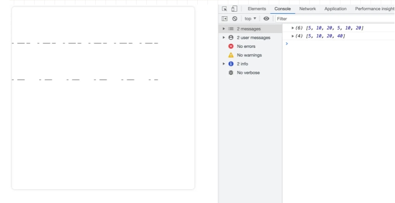

# Canvas

Canvas 最早是由 Apple 引入 WebKit，用于Mac OS X 的 Dashboard，随后被各个浏览器实现。如今除一些过时的浏览器不支持Canvas元素外，所有的新版本主流浏览器都支持它。

## API

#### 1、getContext(param)

获取渲染上下文和绘画功能

**接收(param)参数：**

- 2d：建立一个二维渲染上下文。这种情况可以用 CanvasRenderingContext2D()来替换getContext('2d')。

- webgl（或 experimental-webgl）： 创建一个 WebGLRenderingContext 三维渲染上下文对象。只在实现WebGL 版本1(OpenGL ES 2.0)的浏览器上可用。

- webgl2（或 experimental-webgl2）：创建一个 WebGL2RenderingContext 三维渲染上下文对象。只在实现 WebGL 版本2 (OpenGL ES 3.0)的浏览器上可用。

- bitmaprenderer：创建一个只提供将canvas内容替换为指定ImageBitmap功能的ImageBitmapRenderingContext。


## 一、绘制形状

### 1、线

#### (1) moveTo(x,y)

设置初始位置，参数为初始位置x和y的坐标点

**参数说明：**

- ``x、y``：位置坐标

#### (2) lineTo(x,y)

绘制一条从初始位置到指定位置的直线，参数为指定位置x和y的坐标点

**参数说明：**

- ``x、y``：位置坐标

#### (3) stroke()

通过线条来绘制图形轮廓

### 2、矩形

#### (1) strokeRect(x,y,width,height)

绘制一个矩形的边框

**参数说明：**

- ``x、y``：矩形的起点坐标
- ``width``：矩形的宽度
- ``height``：矩形的高度

#### (2) fillRect(x,y,width,height)

绘制一个填充的矩形

**参数说明：**

- ``x、y``：矩形的起点坐标
- ``width``：矩形的宽度
- ``height``：矩形的高度

#### (3) clearRect(x,y,width,height)

清除指定矩形区域，让清楚部分完全透明

**参数说明：**

- ``x、y``：矩形的起点坐标
- ``width``：矩形的宽度
- ``height``：矩形的高度


### 3、圆

#### (1) arc(x,y,radius,startAngle,endAngle,anticlockwise)

绘制圆弧或圆

**参数说明：**

- ``x、y``：x和y为圆心的坐标
- ``radius``：为半径
- ``startAngle``：为圆弧或圆的开始位置
- ``endAngle``：为圆弧或圆的结束位置
- ``anticlockwise``：是绘制的方向(不写默认为false，从顺时针方向)


### 4、开启和闭合路径

每次新建路径的时候都需要开启和闭合路径，这样不同路径之间才不会相互干扰。

#### (1) beginPath()

新建一条路径，生成之后，图形绘制命令被指向到路径上

#### (2) closePath()

闭合路径之后图形绘制命令又重新指向到上下文中


### 5、填充

#### (1) fill()

stroke方法是通过线条来绘制图形轮廓，而fill方法则是通过填充路径的内容区域生成实心的图形

#### (2) stroke()

通过线条来绘制图形轮廓


### 6、椭圆

#### (1) ellipse(x,y,radiusX,radiusY,rotation,startAngle,endAngle,anticlockwise)

添加椭圆路径

**参数说明：**

- ``x、y``：椭圆的圆心位置
- ``radiusX、radiusY``：x轴和y轴的半径
- ``rotation``：椭圆的旋转角度、已弧度表示
- ``startAngle``：开始绘制点
- ``endAngle``：结束绘制点
- ``anticlockwise``：绘制的方向（默认顺时针），可选参数


### 7、贝塞尔曲线

#### (1) quadraticCurveTo(cp1x,cp1y,x,y)

二次贝塞尔曲线

**参数说明：**

- ``cp1x``：控制点的x轴
- ``cp1y``：控制点的y轴位置
- ``x``：结束点的x轴位置（与lineTo中的x作用一样）
- ``y``：结束点的y轴位置（与lineTo中的y作用一样）

**代码演示：**

```javascript
// 获取 canvas 元素
var canvas = document.getElementById('canvas');
// 通过判断getContext方法是否存在来判断浏览器的支持性
if(canvas.getContext) {
    // 获取绘图上下文
    var ctx = canvas.getContext('2d');
    // 绘制一段二次贝塞尔曲线
    ctx.moveTo(50, 50);
    ctx.quadraticCurveTo(200, 200, 350, 50);
    // 绘制
    ctx.stroke();
}
```

**效果图如下：**


#### (2) bezierCurveTo(cp1x,cp1y,cp2x,cp2y,x,y)

三次贝塞尔曲线和二次贝塞尔曲线不同的是多了一个控制点

**参数说明：**

- ``cp1x``：控制点1的x轴
- ``cp1y``：控制点1的y轴位置
- ``cp2x``：控制点2的x轴
- ``cp2y``：控制点2的y轴位置
- ``x``：结束点的x轴位置（与lineTo中的x作用一样）
- ``y``：结束点的y轴位置（与lineTo中的y作用一样）

**代码演示：**

```javascript
      // 获取 canvas 元素
const canvas = document.getElementById("canvas");
// 通过判断 getContext 方法是否存在赖判断浏览器的支持性
if (canvas.getContext) {
    // 获取绘图上下文
    const ctx = canvas.getContext("2d");
    // 绘制一段三次贝塞尔曲线
    ctx.beginPath(); // 开启路径
    ctx.moveTo(50, 200);
    ctx.bezierCurveTo(150, 50, 250, 350, 350, 200);
    // 绘制
    ctx.stroke();
}
```

**效果图如下：**


## 二、绘制样式

### 1、线条的样式

#### (1)lineWidth

lineWidth 设置当前绘线的粗细，属性必须为正数。默认值为1.0


#### (2)lineCap

lineCap 设置线段端点显示的样子。默认是 butt。

**可选值：**

- butt （末端结束，没有扩展超过其末端）
- round （末端会以半圆形结束，半圆的直径等于线宽，端点处加上了半径为一半线宽的半圆）
- square（末端会以矩形结束，矩形的长度等于线宽，端点处加上了等宽且高度为一半线宽的方块）


#### (3)lineJoin

lineJoin 该属性可以设置两线段连接处所显示的样子。默认是 miter。

**可选值：**

- miter（交点将显示为尖角）
- round （交点将显示为圆角）
- bevel（交点将显示为斜角）


#### (4)miterLimit

miterLimit 限制当两条线相交时交接处最大长度；所谓交接处长度（斜接长度）是指线条交接处内角顶点到外角顶点的长度。

线段之间夹角比较大时，交点不会太远，但随着夹角变小，交点距离会呈指数级增大。


第一个接合处的夹角比较小，接合处会比较尖，交点距离比较大 第二个接合处的夹角比较大，接合处就比较平缓。


`miterLimit` 属性就是用来设定外延交点与连接点的最大距离，默认值为 ``10``，如果交点距离大于此值，**``lineJoin``**  会变成了  **``bevel``**


#### (5)setLineDash/getLineDash

setLineDash 可以设置当前虚线样式。

setLineDash(arr) 中的 arr 长度为 ``奇数`` 或 ``偶数`` 时的效果不太一样

getLineDash 则是返回当前虚线设置的样式，长度为非负偶数的数组。

**代码示例：**

```javascript
 // 获取绘图上下文
      var ctx = canvas.getContext('2d');
      // 绘制一条虚线
      ctx.setLineDash([5, 10, 20]);
      console.log(ctx.getLineDash()); // [5, 10, 20, 5, 10, 20]
      ctx.beginPath();
      ctx.moveTo(0,100);
      ctx.lineTo(400, 100);
      ctx.stroke();
      // 再绘制一条虚线
      ctx.setLineDash([5, 10, 20, 40]);
      console.log(ctx.getLineDash()); // [5, 10, 20, 40]
      ctx.beginPath();
      ctx.moveTo(0,200);
      ctx.lineTo(400, 200);
      ctx.stroke();

```

**效果图如下：**



**对比一下传参为奇数数组和偶数数组的区别：**

设置虚线的时候，如果传参为奇数，例如：ctx.setLineDash([5, 10, 20])，那么 setLineDash 会复制一份数组补全为偶数，相当于我们设置的是：ctx.setLineDash([5, 10, 20, 5, 10, 20])。所以这也就是为什么上图中我们设置的是 [5, 10, 20]，结果打印出来是 [5, 10, 20, 5, 10, 20]


#### (6)lineDashOffect

lineDashOffset 设置虚线样式的起始偏移量。

**代码示例：**

```javascript
// 再绘制一条虚线
ctx.setLineDash([5, 10, 20, 40]);
console.log("获取虚线样式", ctx.getLineDash()); // [5, 10, 20, 40]
ctx.beginPath();
ctx.moveTo(0, 200);
ctx.lineTo(400, 200);
ctx.stroke();
ctx.closePath();

// 添加 lineDashOffset 设置虚线样式的起始偏移量
ctx.setLineDash([5, 10, 20, 40]);
ctx.lineDashOffset = 3;
ctx.beginPath();
ctx.moveTo(0, 300);
ctx.lineTo(400, 300);
ctx.stroke();
ctx.closePath();
```

**效果图如下：**


可以明显看出虚线的总长度没有变化，只是起始点向左位移了3像素。


#### (7)strokeStyle

设置描边样式

**代码示例：**

```javascript
const ctx = canvas.getContext('2d'); // 获取绘制上下文
ctx.strokeStyle = "#f00" // 描边样式设置为红色
ctx.lineWidth = 5

// 绘制一个三角形
ctx.moveTo(50, 100) 
ctx.lineTo(50, 400)
ctx.lineTo(400, 400)
ctx.lineTo(50, 100) 
ctx.stroke();

```

**效果图如下：**


#### (8)fillStyle

设置填充的样式

**代码示例：**

```javascript
const ctx = canvas.getContext('2d'); // 获取绘制上下文
ctx.fillStyle = "#00f" // 填充样式设置为蓝色
ctx.lineWidth = 5

// 如果是填充一个三角形，则只需两条直线就行，它会默认闭合。
ctx.beginPath()
ctx.moveTo(200, 200) 
ctx.lineTo(400, 200)
ctx.lineTo(400, 370)
ctx.fill();


```

**效果图如下：**


### 2、透明度

(1)globalAlpha

设置透明度值

**代码示例：**

```javascript
const ctx = canvas.getContext('2d'); // 获取绘制上下文
// 绘制一个圆
ctx.beginPath()
ctx.fillStyle = "rgba(255, 255, 0, 1)";
// 设置透明度值
ctx.globalAlpha = 0.5;
ctx.arc(200, 200, 100, 0, Math.PI*2, true);
ctx.fill();


```

**效果图如下：**


### 3、渐变

渐变分为 **两种** ，分别是 ``线性渐变`` 和 ``径向渐变`` ，在绘图中我们可以用线性或者径向来填充或描边。

#### (1)createLinearGradient(x1,y1,x2,y2)

线性渐变

**参数说明：**

- x1：起点的x轴坐标
- y1：起点的y轴坐标
- x2：终点的x轴坐标
- y2：终点的y轴坐标

```javascript
// ****** 配合使用 api ******
/* 1.gradient.addColorStop(offset,color) */
// 在渐变的设置中还需要本方法来添加渐变的颜色
// 参数说明：
// 1. color：颜色
// 2. offset：颜色的偏移值，只为 0 到 1 之间的值
// 案例代码：

// 获取绘制上下文
const ctx = canvas.getContext("2d");
// 创建渐变 1
const gradient1 = ctx.createLinearGradient(10, 10, 400, 10);
gradient1.addColorStop(0, "#00ff00");
gradient1.addColorStop(1, "#ff0000");

// 创建渐变 2
const gradient2 = ctx.createLinearGradient(10, 10, 400, 10);
// 从 0.5 的位置才开始渐变
gradient2.addColorStop(0.5, "#00ff00");
gradient2.addColorStop(1, "#ff0000");

ctx.beginPath();
ctx.fillStyle = gradient1;
ctx.fillRect(10, 10, 400, 100);
ctx.closePath();

ctx.beginPath();
ctx.fillStyle = gradient2;
ctx.fillRect(10, 150, 400, 100);
ctx.closePath();

```

​	**效果图如下：**


#### (2)createRadialGradient(x0,y0,r0,x1,y1,r1)

径向渐变

**参数说明**：

- x0、y0：开始圆的坐标x和y轴坐标
- r0：开始圆的半径
- x1、y1：结束圆的坐标x和y轴坐标
- r1：结束圆的半径

**代码示例：**

```javascript
// 用法和 linearGradient类似都需要通过addColorStop添加颜色和偏移量
// 获取绘制上下文
const ctx = canvas.getContext("2d");

// 创建径向渐变 1
// 结束坐标为点,从 外到里发生渐变
const radialGradient1 = ctx.createRadialGradient(
    100,
    100,
    100,
    100,
    100,
    0
);
radialGradient1.addColorStop(0, "#ff770f");
radialGradient1.addColorStop(1, "#ffffff");

// 创建径向渐变 2
// 结束坐标为半径 30 的圆
const radialGradient2 = ctx.createRadialGradient(
    320,
    100,
    100,
    320,
    100,
    30
);
radialGradient2.addColorStop(0, "#ff770f");
radialGradient2.addColorStop(1, "#ffffff");

// 创建径向渐变 3
// 从 0.5 的位置才开始渲染
const radialGradient3 = ctx.createRadialGradient(
    100,
    320,
    100,
    100,
    320,
    0
);
radialGradient3.addColorStop(0.5, "#ff770f");
radialGradient3.addColorStop(1, "#ffffff");

// 创建径向渐变 4
// 开始坐标 和 结束坐标 不一样
const radialGradient4 = ctx.createRadialGradient(
    320,
    320,
    100,
    250,
    250,
    0
);
radialGradient4.addColorStop(0, "#ff770f");
radialGradient4.addColorStop(1, "#ffffff");

// 矩形 1
ctx.beginPath();
ctx.fillStyle = radialGradient1;
ctx.fillRect(10, 10, 200, 200);
ctx.closePath();

// 矩形 2
ctx.beginPath();
ctx.fillStyle = radialGradient2;
ctx.fillRect(220, 10, 200, 200);
ctx.closePath();

// 矩形 3
ctx.beginPath();
ctx.fillStyle = radialGradient3;
ctx.fillRect(10, 220, 200, 200);
ctx.closePath();

// 矩形 4
ctx.beginPath();
ctx.fillStyle = radialGradient4;
ctx.fillRect(220, 220, 200, 200);
ctx.closePath();
```

**效果图如下：**


### 4、图案样式

#### (1)createPattern(image,type)

Canvas 中想绘制的图案效果，个人理解为对标css中的background-image。

**参数说明：**

- image：可以是一个 ``Image`` 对象，也可以是 ``canvas``对象
- type：图案绘制的类型，可用的类型分别有：``repeat``、``repeat-x``、``repeat-y``、``no-repeat``

**代码案例：**

```javascript
// 创建一个 image 对象
const img = new Image();
img.src = "../../static/test/createPattern.png";
img.onload = () => {
    // 图片加载完后回调
    // 创建图案 1 no-repeat 不平铺
    //   const pattern1 = ctx.createPattern(img, "no-repeat");
    //   ctx.fillStyle = pattern1;
    //   ctx.fillRect(0, 0, 500, 500);

    // 创建图案 2 repeat 平铺
    //   const pattern2 = ctx.createPattern(img, "repeat");
    //   ctx.fillStyle = pattern2;
    //   ctx.fillRect(0, 0, 500, 500);

    // 创建图案 3 x 轴方向平铺
    //   const pattern3 = ctx.createPattern(img, "repeat-x");
    //   ctx.fillStyle = pattern3;
    //   ctx.fillRect(0, 0, 500, 500);

    // 创建图案 4 y 轴方向平铺
    const pattern4 = ctx.createPattern(img, "repeat-y");
    ctx.fillStyle = pattern4;
    ctx.fillRect(0, 0, 500, 500);
```


## 三、绘制文本

canvas 中依旧提供了两种方法来渲染文本，一种是描边一种是填充。

### 1、文字

#### (1)strokeText(text,x,y,maxWidth)

描边绘制文本

**参数说明：**

- text：绘制的文案
- x、y：文本的起始位置
- maxWidth：可选参数、最大宽度。需要注意的是当文案大于最大宽度时不是裁剪或者换行，而是缩小字体

**代码案例：**

```javascript
// 获取绘图上下文
const ctx = canvas.getContext("2d");
ctx.font = "50px serif"; // 设置文案大小和字体
ctx.strokeText("Canvas 详解", 50, 50);
```

**效果图如下：**


#### (2)fillText(text,x,y,maxWidth)

填充绘制文本

**参数说明：**

- text：绘制的文案
- x、y：文本的起始位置
- maxWidth：可选参数，最大宽度。需要注意的是当文案大于最大宽度时不是裁剪或者换行，而是缩小字体。

**代码案例：**

```javascript
// 获取绘图上下文
const ctx = canvas.getContext("2d");
ctx.font = "50px serif"; // 设置文案大小和字体
ctx.fillText("Canvas 详解", 50, 50);
```

**效果图如下：**


### 2、文本样式

文本也是可以添加样式的，下面看一下可以设置哪些样式

#### (1)font

用于绘制文本的样式。

默认的字体样式是 10px sans-serif

​						      文案大小 字体


#### (2)textAlign

文本对齐的方式。**默认值：** ``start``

**可选值：**

- ``left``
- ``right``
- ``center``
- ``start``
- ``end``


#### (3)direction

文字的方向。**默认值：**``inherit``

**可选值：**

- ``ltr`` (文字方向从左到右)
- ``rtl`` (文字方向从右到左)
- ``inherit`` (根据情况继承Canvas元素或者Document)

**注意：**

direction 属性会对 textAlign 属性产生影响。

1. 如果 direction 属性设置为 ``ltr``,则 textAlign 属性的 ``left`` 和 ``start`` 的效果相同，``right`` 和 ``end`` 的效果相同
2. 如果 direction 属性设置为 ``rtl`` 则 textAlign 属性的 ``left`` 和 ``end`` 的效果相同，``right`` 和 ``start`` 的效果相同

**代码案例：**

```javascript
// 获取绘图上下文
const ctx = canvas.getContext("2d");
ctx.font = "30px serif"; // 设置文案大小和字体

// 文字 1
ctx.direction = "ltr"; // 文本方向从左向右
ctx.textAlign = "left"; // 左对齐
ctx.strokeText("Hi Canvas !", 170, 100);

// 文字 2
ctx.direction = "ltr"; // 文本方向从左到右
ctx.textAlign = "center"; // 居中对齐
ctx.strokeText("Hi Canvas !", 170, 200);

// 文本 3
ctx.direction = "ltr"; // 文本方向从左到右
ctx.textAlign = "right"; // 右对齐
ctx.strokeText("Hi Canvas !", 170, 300);

// 文本 4
ctx.direction = "rtl"; // 文本方向从右到左
ctx.textAlign = "left"; // 左对齐
ctx.strokeText("Hi Canvas !", 170, 400);

// 文本 5
ctx.direction = "rtl"; // 文本方向从右到左
ctx.textAlign = "center"; // 居中对齐
ctx.strokeText("Hi Canvas !", 170, 500);

// 文本 6
ctx.direction = "rtl"; // 文本方向从右到左
ctx.textAlign = "right"; // 居中对齐
ctx.strokeText("Hi Canvas !", 170, 600);
```

**效果图如下：**


#### (4)textBaseline

基线的对齐选项，决定文字垂直方向的对齐方式。**默认值：** ``alphabetic``

**可选值：**

- ``top``
- ``hanging``
- ``middle``
- ``alphabetic``
- ``ideographic``
- ``bottom``

**代码示例：**

```` javascript
// 获取绘图上下文
const ctx = canvas.getContext("2d");
ctx.font = "25px serif"; // 设置文案大小和字体
ctx.strokeStyle = "red";
const baselines = [
    "top",
    "hanging",
    "middle",
    "alphabetic",
    "ideographic",
    "bottom",
];
baselines.forEach((baseline, index) => {
    ctx.textBaseline = baseline;
    let y = 60 + index * 60;
    ctx.beginPath();
    ctx.moveTo(10, y + 0.5);
    ctx.lineTo(500, y + 0.5);
    ctx.stroke();
    ctx.fillText(
        `Hi Canvas，Welcome to my world！（${baseline}）`,
        10,
        y
    );
});
````


#### (5)measureText

测量文本，返回一个 TextMetrics 对象

**代码案例：**

```` javascript
// 获取绘图上下文
const ctx = canvas.getContext("2d");
ctx.font = "30px serif"; // 设置文案大小和字体

// 测试文案 1
ctx.beginPath();
ctx.strokeText("Hi Canvas !", 150, 100);
const text = ctx.measureText("Hi Canvas !");
console.log("🚀 ~ 文案宽度：", text.width);

// 测试文案 2
ctx.beginPath();
// 设置了文案最大宽度
ctx.strokeText("Hi Canvas !", 150, 200, 100);
const text1 = ctx.measureText("Hi Canvas !");
console.log("🚀 ~ 文案宽度：", text1.width);
````

**效果图如下：**


**总结：**

返回的 TextMetrics对象不受最大宽度等外界因素所影响。

**TextMetrics属性解析：**

**所有属性都是使用 CSS 像素计算的，并且都是只读**

- TextMetrics.width：基于当前上下文字体，计算内联字符串的宽度。

- TextMetrics.actualBoundingBoxLeft：从 textAlign 属性确定的对齐点到文本矩形边界左侧的距离，使用 CSS 像素计算；正值表示文本矩形边界左侧在该对齐点的左侧。

- TextMetrics.actualBoundingBoxRight：从 textAlign 属性确定的对齐点到文本矩形边界右侧的距离。

- TextMetrics.fontBoundingBoxAscent：从 textBaseline 属性标明的水平线到渲染文本的所有字体的矩形最高边界顶部的距离。

- TextMetrics.fontBoundingBoxDescent：从 textBaseline 属性标明的水平线到渲染文本的所有字体的矩形边界最底部的距离。

- TextMetrics.actualBoundingBoxAscent：从 textBaseline 属性标明的水平线到渲染文本的矩形边界顶部的距离。

- Textetrics.actualBoundingBoxDescent：从 textBaseline 属性标明的水平线到渲染文本的矩形边界底部的距离。

- TextMetrics.emHeightAscent：从 textBaseline 属性标明的水平线到线框中 em 方块顶部的距离。

- TextMetrics.emHeightDescent：从 textBaseline 属性标明的水平线到线框中 em 方块底部的距离。

- TextMetrics.hangingBaseline：从 textBaseline 属性标明的水平线到线框的 hanging 基线的距离。

- TextMetrics.alphabeticBaseline：从 textBaseline 属性标明的水平线到线框的 alphabetic 基线的距离。

- TextMetrics.ideographicBaseline：从 textBaseline 属性标明的水平线到线框的 ideographic 基线的距离。


### 3、阴影

(1)shadowOffsetX、shadowOffsetY

``shadowOffsetX`` 和 ``shadowOffsetY`` 用来设定阴影在 X 和 Y 轴的延伸距离，它们是不受变换矩阵所影响的。**负值** 表示阴影会往上或左延伸，**正值** 表示会往下或右延伸。

**默认值：**都为0


(2)shadow
